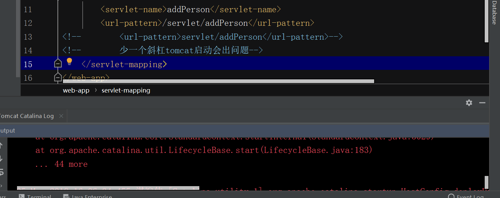
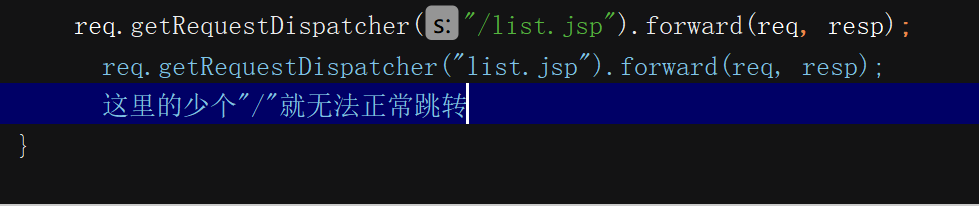
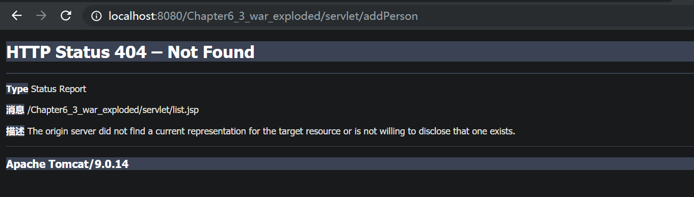
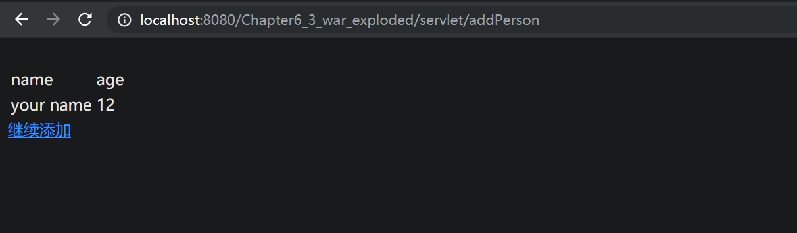
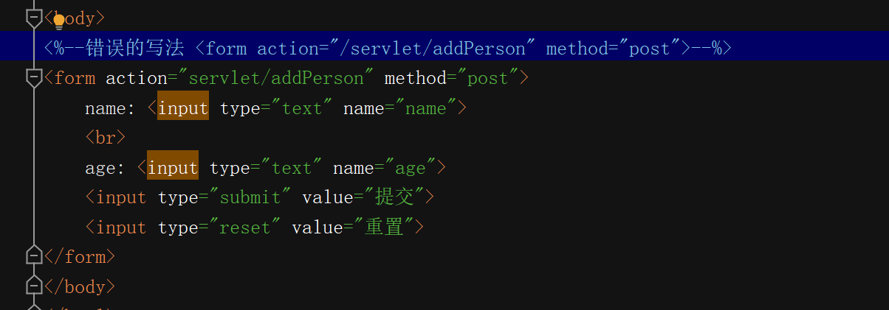
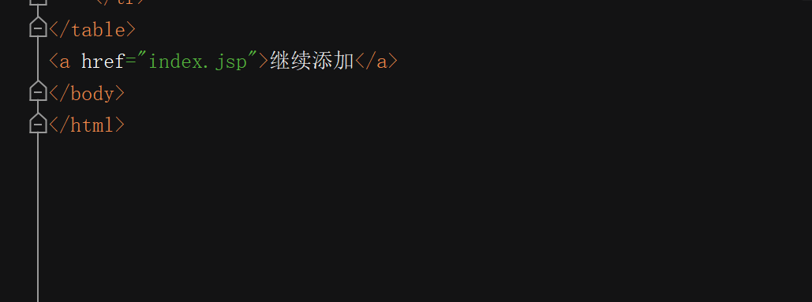
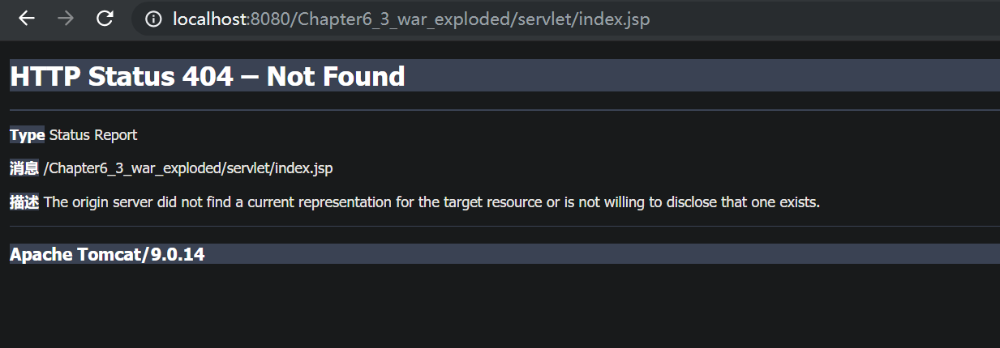

#自己尝试的servlet提交表单

##主要的知识点

### Myservlet的doPost()和doGet()方法
```aidl
 public void doPost(HttpServletRequest req, HttpServletResponse resp) throws ServletException, IOException {
        req.setCharacterEncoding("UTF-8");
        resp.setContentType("text/html");
        Person person = new Person();
        String name = req.getParameter("name");
//        int age = Integer.parseInt(req.getParameter("age"));
        String ageStr = req.getParameter("age");
        int age = 0;
        String regex = "^\\+?[1-9][0-9]*$";        // 正则表达式
        if (ageStr.matches(regex))                   //检验age
            age = Integer.parseInt(ageStr);
        person.setName(name);
        person.setAge(age);
        ServletContext servletContext = getServletContext();   //获取ServletContext对象
        //        List<Person> all = new ArrayList<Person>();
/**
 * 上面注释掉的原因是all是用来存储所有的人的,如果按照上面的代码,则就最多存储一个人
 */
        List<Person> all = (List<Person>) servletContext.getAttribute("person");
        if (all == null) {
            all = new ArrayList<Person>();
        }
        all.add(person);
        servletContext.setAttribute("person", all);
        req.getRequestDispatcher("/list.jsp").forward(req, resp);   //请求转发
    }
```


##  遇到的问题


### 1.在web.xml中urlpattern设置少一个斜杠无法正常启动
不太明白映射访问地址第一个要加"/"




### 2.与第一个问题有点类似,问题在Myservlet.java中



####少个"/"


####加上"/"



###第三个问题也类似
在index.jsp中


###第四个问题
在list.jsp中


这个跳转的路径不对,怎么修改,在我参考的样例里这样可以跳转
[参考的样例](https://github.com/96998/Chapter6_2)



**主要想知道"/"有什么意义,什么时候该加"/"和不加"/",有什么意义**
**Thank you**


##问题解决的过程


依据:
```
主要是路径的问题，URL是统一地址定位器，每个页面或者说模块都有一个唯一的地址。但在实际应用时，有两种定位方式。一种是绝对定位，另一种是相对定位。绝对定位就要以/开头，它是以应用程序的根目录作为绝对根（在JS脚本中/是以http://localhost:8080/为绝对根）。相对位置是相对于当前位置的“虚拟目录”而言，跟文件目录结构类似。
```


分析:
```
根据上述的理论,前两个问题可以轻松的解决,以问题二来分析,list.jsp在web下,web就是根目录
```